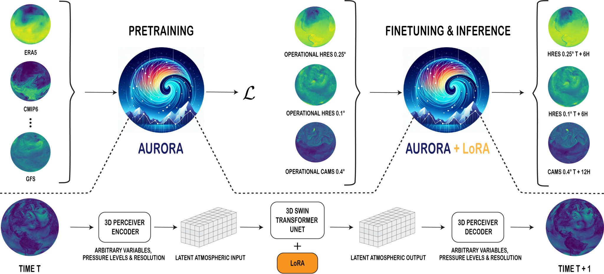

[](https://discord.gg/qUtxnK2NMf)

# Aurora
[](https://discord.gg/agora-999382051935506503) [](https://www.youtube.com/@kyegomez3242) [](https://www.linkedin.com/in/kye-g-38759a207/) [](https://x.com/kyegomezb)




Community and Open Source Implementation of the paper: "Aurora: A Foundation Model of the Atmosphere" in PyTorch: [Paper link](https://arxiv.org/abs/2405.13063)


## Install
```bash
pip3 install aurora-torch
```


# License
MIT


#  Bibtex
```bibtex
@misc{bodnar2024aurora,
    title={Aurora: A Foundation Model of the Atmosphere}, 
    author={Cristian Bodnar and Wessel P. Bruinsma and Ana Lucic and Megan Stanley and Johannes Brandstetter and Patrick Garvan and Maik Riechert and Jonathan Weyn and Haiyu Dong and Anna Vaughan and Jayesh K. Gupta and Kit Tambiratnam and Alex Archibald and Elizabeth Heider and Max Welling and Richard E. Turner and Paris Perdikaris},
    year={2024},
    eprint={2405.13063},
    archivePrefix={arXiv},
    primaryClass={physics.ao-ph}
}
```

# References

- [Blog Release: Introducing Aurora: The first large-scale foundation model of the atmosphere](https://www.microsoft.com/en-us/research/blog/introducing-aurora-the-first-large-scale-foundation-model-of-the-atmosphere/)

- [Paper Link](https://arxiv.org/abs/2405.13063)

<!-- - [Microsoft Twitter Thread]() -->